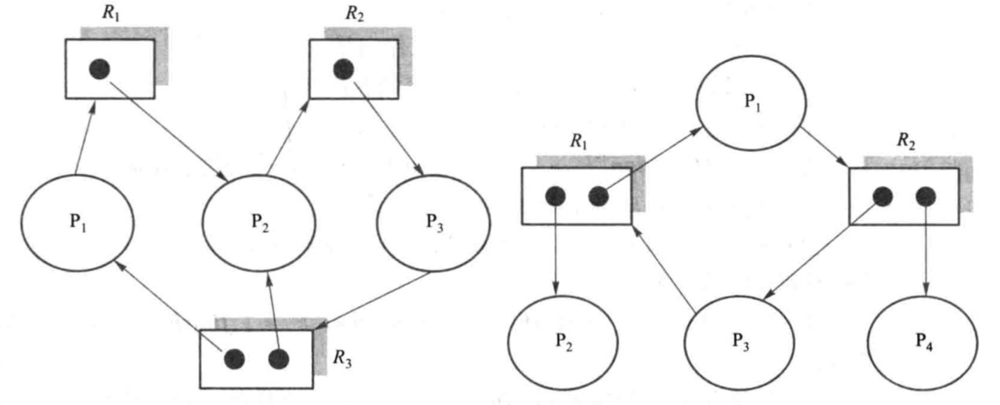

# lec 20 死锁与IPC spoc 思考题

- 有"spoc"标记的题是要求拿清华学分的同学在实体课上完成的，对于学堂在线的选课同学是可选题目。

## 视频相关思考题

### 20.1 死锁概念 

1. 什么是死锁？

 > 死锁：多个进程在执行过程出现无限期循环等待的情况

2. 尝试举一个生活中死锁实例。

 > 双向可行驶的单车道道路

3. 可重用资源和消耗资源有什么区别？

 > 可重用和不可撤销；

4. 资源分配图中的顶点和有向边代表什么含义？

 > 顶点代表进程和资源

 > 有向边代表资源的请求关系（进程P请求资源R）和分配关系（资源R分配给了进程P）

5. 出现死锁的4个必要条件是什么？

 > 互斥

 > 持有并等待

 > 非抢占

 > 循环等待

### 20.2 死锁处理方法

1. 死锁处理的方法有哪几种？它们的区别在什么地方？

 > 死锁预防：确保不会出现死锁条件同时出现的情况；

 > 死锁避免：使用前进行判断，只允许不会出现死锁的资源请求；

 > 死锁检测和恢复：发现死锁后，进行恢复；

2. 安全序列的定义是什么？

 > 进程的最大资源需要量小于当前可用资源与序列中前面进程占用资源的总和；

3. 安全、不安全和死锁有什么区别和联系？

 > 安全时，不会出现死锁；

 > 不安全表示可能出现死锁，但不是一定出现死锁；

### 20.3 银行家算法 

1. 什么是银行家算法？

 > 依据客户申请贷款的最大资金量，银行在每笔贷款前判断贷款后系统是否处于安全状态

2. 安全状态判断和安全序列是一回事吗？

 > 是一回事。存在安全序列表示处于安全状态。

### 20.4 死锁检测

1. 死锁检测与安全状态判断有什么区别和联系？

 > 死锁检测是在资源分配后判断是否存在死锁；没有进程最大资源请求量的要求；

 > 安全状态判断是资源分配前依据进程最大资源请求量判断是否存在安全序列；

 > 死锁检测、安全状态判断和安全序列判断的本质就是资源分配图中的循环等待判断。

### 20.5 进程通信概念

1. 直接通信和间接通信的区别是什么？

 > 本质上来说，直接通信可以理解为两个直接通信，间接通信中假定有一个永远有效的直接通信方。

2. 同步和异步通信有什么区别？

 > 同步通信：通信收方和发方都会等待收发成功后才返回；

 > 异步通信：通信收方和发方在完成数据发送或已有数据接收后立即返回，不会等待收发成功信息；

### 20.6 信号和管道 

1. 什么是信号（signal）？

 > 进程间的软件中断通知和处理机制。

2. 信号通信有什么特点？

 > 类似于中断，信号通信速度快；信息量小，只有一个信号类型值；

3. 什么是管道？

 > 管道是进程间基于内存文件的通信机制。

4. 写一个检查本机网络服务工作状态并自动重启相关服务的程序。

### 20.7 消息队列和共享内存

1. 什么是消息队列？

 > 由操作系统维护的以字节序列为基本单位的间接通信机制。

2. (spoc) 用C语言在Linux系统下写测试用例，测试管道、消息队列和共享内存三种通信机制进行不同通信间隔和通信量情况下的通信带宽、通信延时、带宽抖动和延时抖动方面的性能差异。

 > 参考测试用例：在内存中开指定大小数组，生成随机数据写入数组（最后两个字节为16位的校验和），然后创建指定类型的通信信道并发送和接收数据，收到数据后要利用校验和检测数据正确性；数据收发过程重复指定的次数，并计时；最后通过分析计时数据得到通信带宽、通信延时、带宽抖动和延时抖动等性能数据。

 > [管道的例子](https://github.com/chyyuu/ucore_lab/blob/master/related_info/lab7/ipc/pipe-ex2.c)
 
## 小组思考题

1. （spoc） 每人用python实现[银行家算法](https://github.com/chyyuu/ucore_lab/blob/master/related_info/lab7/deadlock/bankers-homework.py)。大致输出可参考[参考输出](https://github.com/chyyuu/ucore_lab/blob/master/related_info/lab7/deadlock/example-output.txt)。除了`YOUR CODE`部分需要填写代码外，在算法的具体实现上，效率也不高，可进一步改进执行效率。
2. (spoc) 以小组为单位，请思考在lab1~lab5的基础上，是否能够实现IPC机制，请写出如何实现信号，管道或共享内存（三选一）的设计方案。
3. (spoc) 扩展：用C语言实现某daemon程序，可检测某网络服务失效或崩溃，并用信号量机制通知重启网络服务。[信号机制的例子](https://github.com/chyyuu/ucore_lab/blob/master/related_info/lab7/ipc/signal-ex1.c)
## 问答题

### 死锁与并发错误检测

#### Q1：[基础] 为什么会出现死锁。

A:如果进程需要以独占的方式访问资源，当操作系统允许多个进程并发执行时可能会出现进程永远被阻塞现象，如两个进程分别等待对方所占的资源，于是两者都不能执行而处于永远等待状态，此现象称为死锁。

#### Q2：[基础] 下图是否有死锁：


A:左图有，右图没有。有死锁的必要条件：有回路。

#### Q3：[基础] 什么是死锁预防，举例并分析。
A:
通过破坏产生死锁的必要条件（除互斥条件外的其它条件）来防止死锁发生。此方法会导致系统资源利用率过低。

1. 破坏“不可剥夺”条件
　　在允许进程动态申请资源的前提下做出如下规定：一个进程在申请新资源的要求不能立即得到满足，该进程进入等待状态。而处于等待状态下的进程的全部资源可以被他人剥夺，被剥夺的资源重新放到资源表中。
　　该方法适合那些状态是容易保存和恢复的资源，例如，CPU、内存等。但此方法实现起来较为复杂，且代价很大。因为一个资源在使用一段时间后被强制剥夺会造成前阶段工作失效，甚至可能出现某个进程反复申请和释放资源的情况，使得进程执行无限期推迟，还增加了系统开销，延长了进程的周转时间，降低了系统的吞吐量和性能。

2. 破坏“请求和保持”条件
        方法一：每个进程在执行前必须申请它所需的全部资源，仅当系统能满足进程的资源申请并把资源一次性分配给进程后，进程才能执行。这是静态资源分配策略。这种方法的缺点是会严重浪费系统资源，降低资源利用率。
        方法二：仅当进程没有占有资源时才允许他去申请资源，如果进程已占用了某些资源而又要申请新的资源，那他必须先归还所占有的资源再申请新的资源。

3. 破坏“循环等待”条件
　　采用资源有序分配策略，基本思想是将系统中所有的资源顺序编号，一般原则是紧缺、稀有的资源编号较大。进程申请资源时，必须严格按照编号顺序进行，否则不予分配。即一个进程只有得到编号较小的资源后，才能申请编号较大的资源。释放资源时应先释放编号较大的资源。
　　此方法硬性规定申请资源，会给用户编程带来限制，增加了资源使用者的不便；此外如何合理的编号也是一件让人头疼的事。如有进程违反了规定也会造成死锁。

#### Q4：[基础] 描述银行家算法如何判断安全性。

A:
假设进程 P1 申请资源，银行家算法先试探的分配给它（当然先要看看当前资源池中的资源数量够不够），若申请的资源数量小于等于 Available ，然后接着判断分配给 P1 后剩余的资源，能不能使进程队列的某个进程执行完毕，若没c有进程可执行完毕，则系统处于不安全状态（即此时没有一个进程能够完成并释放资源，随时间推移，系统终将处于死锁状态）。

### 进程通信

#### Q1：直接通信和间接通信的本质区别是什么？分别举一个例子。

A:（疑问）是否通过第三方（如内核）。共享内存；pipe（邮件）。

#### Q2：以下代码将如何运行？

```c
#include <stdio.h>
#include <unistd.h>
#include <string.h>
#include <errno.h>
int main()
{
    int fd[2];
    int ret = pipe(fd);
    if (ret == -1)
    {
        perror("pipe error\n");
        return 1;
    }
    pid_t id = fork();
    if (id == 0)  // child
    {
        int i = 0;
        close(fd[0]);
        char child[] = "I am child!";
        while (i < 5)
        {
            write(fd[1], child, strlen(child) + 1);
            sleep(2);
            i++;
        }
    }
    else if (id > 0)  //father
    {
        close(fd[1]);
        char msg[100];
        int j = 0;
        while (j < 5)
        {
            memset(msg,'\0',sizeof(msg));
            ssize_t s = read(fd[0], msg, sizeof(msg));
            printf("%s\n", msg);
            ++j;
        }
    }
    else  //error
    {
        perror("fork error\n");
        return 2;
    }
    return 0;
}
```

A:每隔2秒输出一次“I am child!”，共五次

#### Q3：操作系统把物理机器的硬件资源抽象出来，让用户进程运行在这些抽象的资源上。这样，用户进程可以认为自己 “独占” 一台逻辑上的计算机，而不是和其他进程共用一台机器的资源，从而可以大幅简化用户程序的编写。例如，通过页表机制，操作系统将物理地址空间抽象为逻辑（虚拟）地址空间；不同进程访问的同一个逻辑地址在物理上是不同的地址。通过文件系统机制，操作系统把磁盘抽象成一个一个的文件。通过处理器调度，CPU 被分时复用，可以认为是一个物理 CPU 变成了多个逻辑 CPU。按照这样的类比，本节课所讲的 “信号” 是对什么硬件资源的抽象？它能够帮助我们理解什么现象。你怎么看待这种想法？

A:
中断和异常。如 SIGALRM 是时钟中断，SIGFPE 是对除零/浮点异常。

1. 某信号被触发，执行该信号处理函数的时候，这个信号会被自动屏蔽。（这里只讨论使用 sigaction，而且不设置 SA_NODEFER 的一般情况）这类似对应了跳转到中断处理函数时，硬件关中断的操作。
2. 信号处理函数中，调用某些函数（尤其是 printf）是不安全的。比如我执行 printf 一半的时候，定时的 SIGALRM 被触发，然后信号处理函数里面又 printf，导致两个 printf 输出的内容被交错。中断处理函数也有类似的性质，中断处理函数不能调用某些函数（尤其是 sleep）。

想法不错，我很喜欢。甚至还能拓展，比如 JVM 又把在此基础上做了抽象。正所谓计算机科学银弹：another level of indirection。
注意不是所有的操作系统机制都能被上面的框架囊括，比如同步互斥就很难说是什么硬件资源的抽象。又是一句名言：没有银弹。

#### Q4：比较共享内存和管道各自的优缺点。

A:共享内存：可以快速传输大量数据，不需要切换特权级的开销，但是需要用户负责数据的同步互斥。而且可以多进程共享一块内存，达到多于两个进程之间的通信。
管道：非常方便的进程对之间点对点传输。

#### Q5：Linux/Mac 下运行 ipcs 命令，这个命令是干啥的？

A:没啥，就是列出了 linux 系统中的 ipc 对象，包含 shm / mq / sem。
如果你创建 shm / mq / sem，输出会有变化。

#### Q6：比较管道和信息队列。

A:
消息队列与命名管道类似，但少了打开和关闭管道方面的复杂性。使用消息队列并未解决我们在使用命名管道时遇到的一些问题，如管道满时的阻塞问题。消息队列提供了一种在两个不相关进程间传递数据的简单有效的方法。与命名管道相比：消息队列的优势在于，它独立于发送和接收进程而存在，这消除了在同步命名管道的打开和关闭时可能产生的一些困难。消息队列提供了一种从一个进程向另一个进程发送一个数据块的方法。而且，每个数据块被认为含有一个类型，接收进程可以独立地接收含有不同类型值的数据块。

优点：
A. 我们可以通过发送消息来几乎完全避免命名管道的同步和阻塞问题。
B. 我们可以用一些方法来提前查看紧急消息。